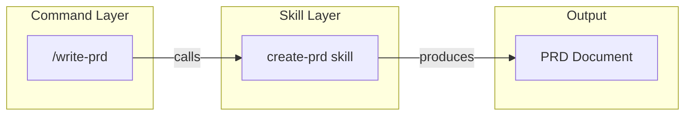
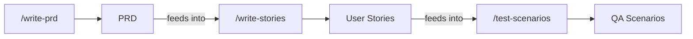

# CCPM-OS — Video Production Package

**Video**: CCPM-OS Introduction (3:30 - 4:15)
**Transcript source**: `Cisco/ccpm-os/video-transcript.md`
**Aspect ratio**: 16:9 (1920x1080)
**Style**: Clean, minimal, dark-mode aesthetic (matches Cursor UI)

---

## Part 1: Slide Deck Outline

---

### Slide 1 — Title / Hook Open

**Duration**: 10 seconds

**Visual**: Dark background. Large centered text fades in:

> "How much time do you spend building the same PM artifacts from scratch?"

Small subtitle below: "PRDs. Battlecards. Roadmaps. Meeting summaries."

**Speaker Notes**:
"How much time do you spend every week building the same PM artifacts from scratch? PRDs, competitive battlecards, roadmaps, meeting summaries, sales enablement kits."

**Assets Needed**:
- Title card (text on dark background, can be created in any slide tool)

---

### Slide 2 — The Problem

**Duration**: 20 seconds

**Visual**: Split screen. Left side: a messy collage of blank documents, scattered sticky notes, and half-finished drafts (stock imagery or simple illustrations). Right side fades in: a clean, structured markdown document appearing line by line.

Text overlay at bottom: "Every time, you start from a blank page."

**Speaker Notes**:
"You know the format. You know what good looks like. But every time, you're starting from a blank page — re-inventing the structure, copy-pasting from old docs, and spending hours on formatting instead of thinking. What if you had an operating system that already knew the playbook?"

**Assets Needed**:
- Stock image or illustration: messy desk / blank docs (left)
- Screenshot: a clean PRD or battlecard output from CCPM-OS (right)

---

### Slide 3 — Introducing CCPM-OS

**Duration**: 15 seconds

**Visual**: Center-aligned large text:

> **CCPM-OS**
> A markdown-first operating system for Product Managers

Below: "40 commands | 70 skills | Built for Cursor"

**Speaker Notes**:
"CCPM-OS is a markdown-first operating system for product managers, built to run inside Cursor. It gives you 40 slash commands and 70 reusable skills — covering everything from strategy and execution to market research, go-to-market, and personal productivity."

**Assets Needed**:
- Title card (text only)

---

### Slide 4 — Repository Structure

**Duration**: 15 seconds

**Visual**: Screenshot of the repository folder tree in Cursor's sidebar, expanded to show:

```
ccpm-os/
├── commands/
│   ├── execution/
│   ├── go-to-market/
│   ├── market-research/
│   ├── marketing-growth/
│   ├── product-discovery/
│   ├── product-strategy/
│   └── toolkit/
├── skills/
│   ├── execution/
│   ├── go-to-market/
│   ├── ...
```

Highlight the two top-level folders: `commands/` and `skills/`.

**Speaker Notes**:
(Continues from slide 3, no new narration — visual pause to let the viewer absorb the structure)

**Assets Needed**:
- **CAPTURE**: Screenshot of Cursor sidebar with `commands/` and `skills/` folders expanded one level (see Shot List item A1)

---

### Slide 5 — Two-Layer Architecture

**Duration**: 15 seconds

**Visual**: Architecture diagram (see Diagram 1 below). Three boxes connected by arrows:

```
[/write-prd] --calls--> [create-prd skill] --produces--> [PRD Document]
  Command                    Skill                         Output
```

Label below: "Commands are workflows. Skills are playbooks."

**Speaker Notes**:
"The system has two layers. Commands are the workflows — you invoke them with a slash, give them your input, and they walk you through a structured process. Skills are the playbooks underneath — the detailed templates, frameworks, and best practices that commands draw from. You don't need to manage any of this. Clone the repo, open it in Cursor, type a slash — and you're running."

**Assets Needed**:
- **CREATE**: Architecture diagram (render from Mermaid source in Part 3)

---

### Slide 6 — Example 1: Title Card

**Duration**: 5 seconds

**Visual**: Section divider slide. Large text:

> **Example 1**
> Writing a PRD

**Speaker Notes**:
"Let me show you what this looks like in practice. Say you have a feature idea."

**Assets Needed**:
- Title card (text only)

---

### Slide 7 — Example 1: Command Input

**Duration**: 15 seconds

**Visual**: Screen recording of Cursor chat panel. The user types:

```
/write-prd SSO support for enterprise customers
```

Show the command being invoked and the AI beginning to respond with clarifying questions.

**Speaker Notes**:
"You open Cursor chat and type: /write-prd SSO support for enterprise customers. The command asks a few targeted questions — who's the user, what's the success metric, any constraints?"

**Assets Needed**:
- **CAPTURE**: Screen recording of typing `/write-prd SSO support for enterprise customers` in Cursor chat (see Shot List item B1)

---

### Slide 8 — Example 1: PRD Output

**Duration**: 15 seconds

**Visual**: Screen recording or scrolling screenshot of the generated PRD. Briefly pause on:
1. The section headings (Executive Summary, Background, Objectives...)
2. The success metrics table
3. The P0 user stories table

**Speaker Notes**:
"Then it generates a full Product Requirements Document: executive summary, background, objectives with measurable success metrics, target users, prioritized user stories in P0/P1/P2 tiers, solution overview, open questions, and a phased timeline. What used to take an afternoon now takes minutes. And the structure is consistent every time."

**Assets Needed**:
- **CAPTURE**: Screen recording or long screenshot of a generated PRD, scrolling through sections (see Shot List item B2)

---

### Slide 9 — Example 2: Battlecard

**Duration**: 20 seconds

**Visual**: Screen recording. User types:

```
/battlecard Our CRM vs Salesforce for mid-market teams
```

Then show the battlecard output. Briefly highlight:
1. "We win when / We lose when" quick summary
2. Feature comparison table
3. Objection handling section

**Speaker Notes**:
"Now say your sales team keeps running into a competitor. You type: /battlecard Our CRM vs Salesforce for mid-market teams. The command researches the competitor, then produces a one-page battlecard: where you win, where you lose, a feature comparison matrix, objection handling with proof points, landmine questions to plant, and conversation starters for displacement deals. Your sales reps get something they can actually use on a call — not a 20-page document nobody reads."

**Assets Needed**:
- **CAPTURE**: Screen recording of `/battlecard` command and output (see Shot List item B3)

---

### Slide 10 — Example 3: Weekly Brain Dump Input

**Duration**: 10 seconds

**Visual**: Screen recording. User types:

```
/weekly-braindump
```

Then pastes a messy, unstructured block of text — a mix of work tasks, personal reminders, and half-formed ideas.

**Speaker Notes**:
"This one is personal. Sunday evening, you paste everything on your mind — work tasks, personal commitments, half-formed ideas."

**Assets Needed**:
- **CAPTURE**: Screen recording of `/weekly-braindump` with pasted raw text (see Shot List item B4)

---

### Slide 11 — Example 3: Weekly Plan Output

**Duration**: 15 seconds

**Visual**: Screen recording or scrolling screenshot of the structured output. Briefly highlight:
1. Day-by-day plan with themed day headers
2. Delegation table (task, owner, due date)
3. Calendar event table

**Speaker Notes**:
"The command sorts every item into categories, decides what to do, schedule, delegate, defer, or delete — then builds a day-by-day weekly plan with themed days, deep work blocks protected, a delegation list with owners and due dates, and a calendar-ready event table you can paste directly into your calendar tool. From chaos to a clean week in two minutes."

**Assets Needed**:
- **CAPTURE**: Screen recording or long screenshot of weekly plan output (see Shot List item B5)

---

### Slide 12 — Benefit: Speed

**Duration**: 10 seconds

**Visual**: Side-by-side comparison. Left: "Before" with a clock showing "3 hours" and a blank document icon. Right: "After" with a clock showing "5 minutes" and a completed document icon.

**Speaker Notes**:
"Four things make this system different. Speed. Artifacts like writing a blog that took hours now take minutes. The structure is already there — you focus on the content and decisions, not the formatting."

**Assets Needed**:
- Graphic: before/after time comparison (simple, can be built in slides)

---

### Slide 13 — Benefit: Consistency

**Duration**: 10 seconds

**Visual**: Three document icons in a row (PRD, Battlecard, Roadmap), all with the same structural outline visible. Text: "Same proven structure. Every time."

**Speaker Notes**:
"Consistency. Every Blog, every gap analysis, every win/loss report follows the same proven structure. Your speak the same language, and stakeholders always know where to find what they need."

**Assets Needed**:
- Graphic: three document icons with matching outlines (simple slide graphic)

---

### Slide 14 — Benefit: Composability

**Duration**: 15 seconds

**Visual**: Composability chain diagram (see Diagram 2 below). Three boxes connected by arrows:

```
/write-prd --> /write-stories --> /test-scenarios
  PRD            User Stories       QA Scenarios
```

Each arrow shows a document flowing to the next command.

**Speaker Notes**:
"Composability. Commands chain together naturally. Write a PRD, then run /write-stories to generate user stories from it, then /test-scenarios to create QA scenarios. Each output feeds the next."

**Assets Needed**:
- **CREATE**: Composability diagram (render from Mermaid source in Part 3)

---

### Slide 15 — Benefit: Customizable

**Duration**: 10 seconds

**Visual**: A code editor showing a SKILL.md file being edited. Text overlay: "Just markdown files. Add your own."

**Speaker Notes**:
"Customizable. The whole system is just markdown files in a repo. Want a new workflow? Add a command. Want to change the PRD template? Edit the skill. Your team's best practices become reusable infrastructure, not tribal knowledge locked in someone's head."

**Assets Needed**:
- **CAPTURE**: Screenshot of a SKILL.md file open in Cursor editor (see Shot List item A2)

---

### Slide 16 — Getting Started: Clone

**Duration**: 15 seconds

**Visual**: Terminal recording. Show:

```bash
git clone https://github.com/<org>/ccpm-os.git
```

Then Cursor opening the folder.

**Speaker Notes**:
"Getting started takes about 30 seconds. Clone the repository. Open the folder in Cursor. That's it."

**Assets Needed**:
- **CAPTURE**: Terminal recording of `git clone` + Cursor opening (see Shot List item C1)

---

### Slide 17 — Getting Started: Slash Menu

**Duration**: 15 seconds

**Visual**: Screenshot of the Cursor chat panel slash command menu, showing the list of available commands organized by category.

Text overlay: "Type / and go."

**Speaker Notes**:
"Cursor automatically picks up the commands and skills. Type slash in the chat panel, and you'll see all 40 commands organized by category. Pick one, paste your input, and go. One thing to know: by default, the system plans first and waits for your approval before making changes. It asks at most two clarifying questions, then assumes sensible defaults. You stay in control."

**Assets Needed**:
- **CAPTURE**: Screenshot of Cursor slash command menu (see Shot List item A3)

---

### Slide 18 — Close / CTA

**Duration**: 15 seconds

**Visual**: Clean dark slide. Large centered text:

> **CCPM-OS**
> github.com/\<org\>/ccpm-os

Subtitle: "Clone it. Make it yours. Stop starting from scratch."

Fade to logo or end card.

**Speaker Notes**:
"CCPM-OS is open source and ready to use today. Clone the repo, make it your own, and stop building PM artifacts from scratch. If you build a command your team loves, consider contributing it back."

**Assets Needed**:
- End card with repo URL (text only)

---

## Part 2: Shot List / Screen Recording Guide

All recordings at 1920x1080. Use a clean Cursor workspace with the ccpm-os repo open. Hide any personal or sensitive tabs.

### A — Static Screenshots

| ID | What to Capture | Setup | Notes |
|----|----------------|-------|-------|
| A1 | Cursor sidebar with repo structure | Open ccpm-os in Cursor, expand `commands/` and `skills/` one level | Crop to sidebar only, dark theme |
| A2 | SKILL.md file open in editor | Open `skills/execution/create-prd/SKILL.md` in the editor pane | Show the YAML frontmatter and first few sections |
| A3 | Slash command menu in chat | Open Cursor chat, type `/`, wait for the command dropdown to appear | Capture the full dropdown showing categories |

### B — Screen Recordings (command demos)

| ID | What to Record | Steps | Duration | Notes |
|----|---------------|-------|----------|-------|
| B1 | `/write-prd` input | 1. Open Cursor chat. 2. Type `/write-prd SSO support for enterprise customers`. 3. Press Enter. 4. Wait for AI to start responding. | 15-20 sec | Stop after the first response appears |
| B2 | `/write-prd` output | Scroll through a completed PRD output. Pause briefly on: section headings, success metrics table, P0 user stories table. | 15-20 sec | Can be from a pre-generated output if live demo is too slow |
| B3 | `/battlecard` full flow | 1. Type `/battlecard Our CRM vs Salesforce for mid-market teams`. 2. Show the output. 3. Scroll to highlight: Quick Summary, comparison table, objection handling. | 25-30 sec | Can be edited down to 20 sec in post |
| B4 | `/weekly-braindump` input | 1. Type `/weekly-braindump`. 2. Paste a block of messy, unstructured text (prepare this in advance). | 10-15 sec | Prepare a realistic-looking brain dump in a text file beforehand |
| B5 | `/weekly-braindump` output | Scroll through the structured output. Highlight: themed day headers, delegation table, calendar event table. | 15-20 sec | Can be from a pre-generated output |

### C — Terminal / Setup Recordings

| ID | What to Record | Steps | Duration | Notes |
|----|---------------|-------|----------|-------|
| C1 | Git clone + Cursor open | 1. Open terminal. 2. Run `git clone https://github.com/<org>/ccpm-os.git`. 3. Run `cursor ccpm-os/` or show Cursor File > Open Folder. | 10-15 sec | Use a clean terminal with minimal prompt |

### D — Diagrams (create from Mermaid)

| ID | Diagram | Source | Notes |
|----|---------|--------|-------|
| D1 | Architecture diagram | See Part 3, Diagram 1 | Render at 1920x1080, dark background preferred |
| D2 | Composability chain | See Part 3, Diagram 2 | Render at 1920x1080, dark background preferred |

---

## Part 3: Diagram Specs (Mermaid Source)

Render these using any Mermaid tool (mermaid.live, Mermaid CLI, or a VS Code extension). Export as PNG at 1920x1080.

### Diagram 1: Two-Layer Architecture



**Usage**: Slide 5
**Caption**: "Commands are workflows. Skills are playbooks."

---

### Diagram 2: Composability Chain



**Usage**: Slide 14
**Caption**: "Commands chain together. Each output feeds the next."

---

## Part 4: Slide-by-Slide Mapping

| Transcript Section | Time | Slides | Key Visual |
|-------------------|------|--------|------------|
| 1. Hook / Problem | 0:00 - 0:30 | 1-2 | Text card + before/after montage |
| 2. What is CCPM-OS | 0:30 - 1:15 | 3-5 | Intro text, repo structure screenshot, architecture diagram |
| 3. Examples | 1:15 - 2:45 | 6-11 | Three command demos (screen recordings) |
| 4. Benefits | 2:45 - 3:30 | 12-15 | Speed comparison, consistency graphic, composability diagram, editor screenshot |
| 5. Getting Started | 3:30 - 4:00 | 16-17 | Terminal recording, slash menu screenshot |
| 6. Close / CTA | 4:00 - 4:15 | 18 | End card with repo URL |

---

## Pre-Production Checklist

- [ ] Prepare a sample brain dump text file for the `/weekly-braindump` demo (B4)
- [ ] Pre-generate outputs for all 3 command demos (in case live generation is too slow for recording)
- [ ] Render both Mermaid diagrams as PNG at 1920x1080 (D1, D2)
- [ ] Capture all 3 static screenshots (A1, A2, A3)
- [ ] Record all 5 screen recordings (B1-B5) + 1 terminal recording (C1)
- [ ] Choose background music (upbeat, not distracting, lower during narration)
- [ ] Record voiceover narration (~850 words, target 3:30 - 4:15)
- [ ] Assemble in video editor: narration + slides + recordings synced to transcript timestamps
